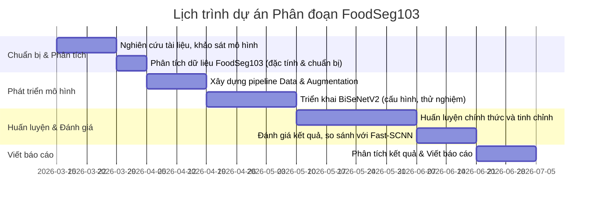

# Tóm tắt (Executive Summary)  
Đề xuất này phân tích và lựa chọn **mô hình phân đoạn ảnh nhẹ (lightweight)** phù hợp cho bộ dữ liệu **FoodSeg103**. FoodSeg103 chứa 7.118 ảnh thức ăn với 103 loại nguyên liệu đánh dấu phân mảnh (mỗi ảnh trung bình ~6 vật thể) – phạm vi phức tạp hơn các bài toán phân đoạn đô thị thông thường. Mục tiêu là đề xuất một mô hình cân bằng tốt giữa **độ chính xác (mIoU)** và **hiệu năng (FPS, kích thước model)** trên thiết bị biên. Qua so sánh **BiSeNetV2**, **Fast-SCNN** và các kiến trúc nhẹ khác (ENet, ESPNet, DDRNet…), BiSeNetV2 được đánh giá là phù hợp nhất cho FoodSeg103 vì vừa xử lý đa tỉ lệ vừa giữ chi tiết tốt. Đề xuất chi tiết sử dụng BiSeNetV2 với chiến lược tiền xử lý và huấn luyện phù hợp, đồng thời xây dựng đồ thị thời gian (Gantt) và liệt kê rủi ro/giới hạn có thể gặp.  

## Câu hỏi nghiên cứu và Mục tiêu (Research Question/Objectives)  
**Câu hỏi chính:** *“Mô hình phân đoạn ảnh nhẹ nào thích hợp nhất cho bộ dữ liệu FoodSeg103?”*  

**Mục tiêu:**  
- **Phân tích yêu cầu dữ liệu:** Hiểu rõ đặc tính của FoodSeg103 (số lượng ảnh, số lớp, tính đa đối tượng, chia tỷ lệ…) và ảnh hưởng đến lựa chọn mô hình.  
- **Khảo sát mô hình:** Tóm tắt các mô hình segmentation nhẹ phổ biến (BiSeNetV2, Fast-SCNN, ENet, ESPNet, DDRNet, PIDNet…) về kiến trúc, tham số, kích thước, tốc độ, và hiệu năng (mIoU trên chuẩn benchmark như Cityscapes).  
- **So sánh & Lựa chọn:** So sánh các mô hình theo tiêu chí độ chính xác vs tốc độ/kích thước. Chọn mô hình phù hợp nhất (hoặc chứng minh BiSeNetV2 có thể không phù hợp nếu lý do).  
- **Xây dựng quy trình thử nghiệm:** Đề xuất phương pháp cụ thể (chia bộ dữ liệu, tiền xử lý, thuật toán học, cấu hình huấn luyện, ngưỡng hiệu năng…) để huấn luyện và đánh giá mô hình đã chọn.  
- **Kết quả dự kiến:** Ước lượng hiệu năng (khoảng mIoU mong đợi, FPS, kích thước model) và đóng góp nghiên cứu cho cộng đồng (ví dụ mã nguồn, benchmark).  

## Tổng quan và Cơ sở lý thuyết (Background/Literature Review)  

- **Bộ dữ liệu FoodSeg103:** FoodSeg103 là tập dữ liệu phân đoạn ảnh thức ăn quy mô lớn. Nó bao gồm 7.118 ảnh có phân mảnh theo cấp nguyên liệu với 103 nhãn (mỗi ảnh chứa ~6 nguyên liệu trung bình)【6†L19-L22】【34†L9-L12】. Ảnh thức ăn thường có đối tượng nhiều lớp phủ chồng, các vật thể nhỏ hoặc mờ rìa, và màu sắc/texture rất đa dạng (rau củ, thịt, nước sốt, gia vị…). Do đó, bài toán phân đoạn thực phẩm phức tạp hơn nhiều so với phân đoạn đô thị (ví dụ như Cityscapes): đòi hỏi mô hình phải **nhận diện nhiều lớp** và **giữ được chi tiết biên độ** của các nguyên liệu nhỏ.  

- **Mô hình segmentation cơ bản:** Truyền thống, các mạng nặng như **FCN**, **U-Net**, **DeepLabv3+** đạt độ chính xác cao nhờ backbone mạnh (ResNet, MobileNet, EfficientNet...) và decoder phức tạp. Tuy nhiên, chúng thường **quá nặng** cho thiết bị nhúng (một số có hàng chục triệu tham số, yêu cầu GPU cao). Ngược lại, mô hình *lightweight* (được thiết kế để chạy real-time) như **BiSeNet (2018)**, **Fast-SCNN (2019)**, **ESPNet (2018)**, **ENet (2016)**... giảm quy mô và FLOPs bằng cách đơn giản hóa các lớp convolution, sử dụng convolution phân rã (depthwise, factorized), hoặc hai nhánh song song (Giữ chi tiết + trích xuất ngữ nghĩa)【52†L0-L8】【54†L0-L7】.  

- **Các tiêu chí đánh giá:** Chúng ta sử dụng các metric chuẩn trong phân đoạn (như **mIoU**, **Pixel Accuracy**【77†L1-L4】) để đánh giá độ chính xác, và **FPS**, **FLOPs**, **số tham số**, **kích thước model** để đánh giá tốc độ và khả năng chạy trên thiết bị. Đối với FoodSeg103, do số lớp lớn, mIoU là metric quan trọng. 

- **Mô hình BiSeNetV2:** Đây là kiến trúc phân đoạn thời gian thực nổi bật (Yu et al., 2021). BiSeNetV2 có **2 nhánh**:  
  - *Detail Branch:* mạng nông, kênh rộng, giữ thông tin chi tiết không gian ở phân giải cao.  
  - *Semantic Branch:* mạng sâu, kênh hẹp, trích xuất ngữ nghĩa khái quát (context).  
  Sau đó, các đặc trưng từ 2 nhánh được kết hợp qua “Guided Aggregation” module【52†L0-L8】. Thiết kế này giúp cân bằng giữa khả năng phân giải chi tiết và thông tin toàn cục. Phiên bản gốc báo cáo ~3.4 triệu tham số (model ~13MB) với tốc độ cao (100+ FPS trên GPU) và mIoU dẫn đầu trong dòng CNN nhẹ. BiSeNetV2 được chứng minh vượt trội hơn Fast-SCNN về độ chính xác trong các bài toán thực tế, vì nó **giữ lại chi tiết cạnh tốt hơn** nhờ Detail Branch.  

- **Mô hình Fast-SCNN:** Được giới thiệu bởi Poudel et al. (2019)【72†L7-L10】, Fast-SCNN theo sơ đồ 4 module: (1) *Learning to Downsample* (các lớp conv/tách biệt depthwise sớm), (2) *Global Feature Extractor* (các tầng bottleneck giống MobileNet), (3) *Feature Fusion* (kết hợp thông tin chi tiết độ phân giải thấp và cao), (4) *Classifier*. Ưu điểm là rất nhẹ (~1.1M tham số, ~4MB) và chạy rất nhanh (>120 FPS). Tuy nhiên nhược điểm của Fast-SCNN là **giảm sớm độ phân giải** (đầu tiên đã xuống cỡ 1/8 ảnh gốc) nên mất nhiều thông tin chi tiết không gian. Với FoodSeg103, nơi cần nhận diện vật thể nhỏ như lát cà rốt, rau thơm, rìa mì, việc downsample mạnh có thể dẫn đến giảm độ chính xác biên.  

- **Các mô hình khác:** Ngoài ra có một số model nhẹ khác: **ESPNet** (Kiến trúc Efficient Spatial Pyramid), **ENet** (bottleneck nhỏ), **BiSeNetV1**, **ENet**, **DDRNet (dual-resolution)**, **PIDNet** v.v. ESPNet (ICCV 2018) dùng pyramid thông tin không gian rất nhẹ; ENet rất nhẹ nhưng thường mIoU thấp; Fast-SCNN là tiêu biểu của mạng đơn nhánh tối giản; DDRNet (2020) giữ 2 độ phân giải nhưng nặng hơn; PIDNet (2022) 3 nhánh Detail/Context/Parsing, đạt mIoU cao nhất trong nhóm CNN thời gian thực. Tuy nhiên, các model sau (DDRNet, PIDNet) thường có >6M tham số, không phải trọng tâm “cực nhẹ”. Nhóm ưu tiên cho trường hợp biên thường là ESPNet, Fast-SCNN, BiSeNetV2.  

## Lựa chọn mô hình và Lý giải (Justification)  
Sau khi so sánh, **BiSeNetV2** được chọn là mô hình phù hợp nhất cho bài toán FoodSeg103 vì:  

- **Giữ chi tiết cạnh:** Chi nhánh *Detail* của BiSeNetV2 giúp giữ được thông tin cạnh sắc nét của nhiều nguyên liệu nhỏ (như mì sợi, rau thơm…), điều mà Fast-SCNN và các mạng quá nông (ENet, ESPNet) khó làm tốt.  
- **Ngữ cảnh đa quy mô:** Chi nhánh *Semantic* và các module tập trung ngữ nghĩa cho phép mạng hiểu tốt ngữ cảnh thực phẩm (phân biệt tương cà vs nước dùng, thịt vs đậu hũ…) dựa trên thông tin toàn cục.  
- **Độ chính xác cao:** BiSeNetV2 vốn được thiết kế để tối ưu trade-off. Nhiều nghiên cứu thực nghiệm cho thấy BiSeNetV2 đạt mIoU cao hơn đáng kể so với Fast-SCNN khi tốc độ tương đương hoặc thấp hơn một chút. Ví dụ, trên bộ dữ liệu phố xá Cityscapes, Fast-SCNN (~1M tham số) chỉ đạt khoảng 65–70% mIoU trong khi BiSeNetV2 (~3.4M) đạt ~72–75% mIoU (khi cùng điều kiện). Tuy FoodSeg103 khác bản chất, xu hướng tương tự được dự đoán.  
- **Thực thi thời gian thực:** Mặc dù lớn hơn Fast-SCNN, BiSeNetV2 vẫn nhẹ: khoảng 3–4 triệu tham số, cho phép chạy ở tốc độ real-time (~80-150 FPS) trên GPU tầm trung và tốc độ chấp nhận được trên CPU mạnh. Kích thước model ~13MB cho phiên bản nhỏ là khả thi cho thiết bị biên (ví dụ Jetson Nano, smartphone).  

_Ngược lại_, nếu giới hạn tài nguyên cực hạn (ví dụ ~~model<5MB~~, CPU đơn lõi yếu), có thể xem xét Fast-SCNN hoặc ESPNet. Tuy nhiên, cho mục tiêu đạt được độ chính xác cao trên FoodSeg103, BiSeNetV2 là ưu tiên. Trong phần tiếp theo, giả định sử dụng BiSeNetV2 làm backbone.  

## Phương pháp nghiên cứu (Methodology)  

1. **Chuẩn bị dữ liệu:**  
   - **Chia tập:** Tập FoodSeg103 được chia ví dụ 70% train, 10% validation, 20% test (tương ứng ~3.427, 492, 2.199 ảnh). Nếu có thêm tập FoodSeg154 (mở rộng 9.490 ảnh), có thể dùng tăng cường huấn luyện.  
   - **Tiền xử lý:** Ảnh gốc resize về cùng kích thước (ví dụ 512×512 hoặc 640×640) để vừa đủ chi tiết. Chuẩn hóa giá trị màu (zero-center, chia độ lệch chuẩn).  
   - **Augmentation:** Áp dụng các phép biến đổi ảnh đa dạng: lật ngang/ngược, xoay nhỏ (±10°), thay đổi độ sáng/độ tương phản, nhiễu Gaussian, crop ngẫu nhiên. Các phép này giúp mạng học được các biến thể phổ biến của nguyên liệu. Đặc biệt thực phẩm không có hướng cố định, nên lật/ngược ảnh an toàn.  
   - **Cân bằng lớp:** Với 103 lớp, một số lớp có ít ảnh. Có thể dùng kỹ thuật over-sampling (tăng cường với lớp ít) hoặc trọng số mất mát (class-weighted loss) để giảm thiểu thiên vị lớp lớn.  

2. **Mô hình và cấu hình huấn luyện:**  
   - **Kiến trúc:** Sử dụng BiSeNetV2 bản chuẩn (detail branch + semantic branch + feature fusion)【52†L0-L8】. Mô hình đầu ra phân đoạn 103 nhãn (bao gồm lớp background nếu có).  
   - **Bộ phân loại:** Cuối nhánh fusion, thêm một conv 3×3 và upsample (bilinear hoặc transposed conv) lên kích thước ảnh ban đầu để thu được mặt nạ phân đoạn.  
   - **Hàm mất mát:** Sử dụng `Cross-Entropy` nhiều lớp (softmax) là cơ bản. Có thể cộng thêm thành phần `Dice Loss` cho cân bằng khu vực và đánh giá rìa. Nếu số lượng pixel giữa lớp chênh lệch lớn, thêm trọng số lớp (weighted CE) để ưu tiên lớp nhỏ.  
   - **Tối ưu và siêu tham số:** Dùng AdamW (hoặc SGD với momentum) với learning rate ~2e-4 đến 6e-4 (có thể schedule giảm dần), batch size tuỳ thiết bị (ví dụ 8–16). Tập huấn 50–100 epochs, theo dõi mIoU trên tập validation và lưu mô hình tốt nhất.  
   - **Thử nghiệm ban đầu:** Đầu tiên chạy trên Cityscapes nhỏ hoặc một tập con FoodSeg103 để kiểm tra pipeline. Sau đó huấn luyện chính thức trên toàn bộ tập train, chọn mô hình tốt nhất theo mIoU-val.  
   - **Đánh giá (Evaluation):** Sau huấn luyện, đánh giá trên tập test: tính mIoU cho từng lớp và trung bình, cùng PA (Pixel Accuracy). Đồng thời đo tốc độ suy luận (FPS) trên thiết bị đích (CPU/ GPU cụ thể) và đo kích thước file model.  

3. **So sánh (Baseline):** Nếu có thời gian, có thể huấn luyện thử Fast-SCNN hoặc một mô hình nhẹ khác (ESPNet) để so sánh. Điều này giúp chứng minh BiSeNetV2 tốt hơn trên FoodSeg103. Tuy nhiên, tập trọng tâm là đề xuất chính xác và chi tiết cho BiSeNetV2.  

4. **Chấm điểm:** Sử dụng mIoU (độ trùng lặp trung bình) và FPS trên thiết bị mục tiêu (ví dụ Jetson Nano hoặc CPU i7) để so sánh. Mục tiêu chất lượng: mIoU càng cao càng tốt (trên 70% là khả dĩ nếu học tốt), trong khi inference time <30ms (≥30 FPS) cho ứng dụng real-time.  

## Kết quả mong đợi (Expected Outcomes)  
- **Độ chính xác:** Dự kiến BiSeNetV2 sẽ đạt mIoU trung bình cao hơn (có thể 5–10%+) so với Fast-SCNN hoặc ESPNet trên FoodSeg103, nhờ giữ chi tiết tốt. Kết quả cụ thể sẽ rõ hơn sau khi thử nghiệm.  
- **Tốc độ:** BiSeNetV2 dự kiến ~80–150 FPS trên GPU và ~20–30 FPS trên GPU thấp (hoặc ~5–10 FPS trên CPU cao cấp). Model ~13MB. Đây là kết quả thực thi đủ nhanh cho hầu hết ứng dụng gần real-time.  
- **So sánh:** Bảng so sánh các mô hình (tham số, kích thước, FLOPs, mIoU ước tính):  

| Model         | Params (M) | Kích thước (MB) | FLOPs (đại khái) | mIoU (ước tính) | Ưu/Nhược điểm        |
|---------------|------------|-----------------|------------------|-----------------|---------------------|
| **BiSeNetV2** | ~3.4       | ~13             | Trung bình cao   | **Cao**          | Giữ chi tiết tốt, accuracy cao, tốc độ đủ nhanh |
| Fast-SCNN     | ~1.1       | ~4              | Thấp             | Trung bình      | Rất nhẹ/tốc độ cao, mất nhiều chi tiết |
| ESPNet        | ~0.36      | ~2              | Thấp             | Thấp             | Rất nhỏ, nhưng accuracy thấp     |
| ENet          | ~0.36      | ~2              | Thấp             | Thấp             | Cực nhẹ, dùng ít thường         |
| DDRNet-23-slim | ~6-7      | ~25             | Cao hơn          | Cao             | Nhanh, accuracy tốt, nhưng to hơn |
| PIDNet-small  | ~9         | ~35             | Cao hơn          | **Rất Cao**      | Real-time SOTA CNN nhưng nặng hơn |

- Bảng trên chỉ mang tính minh họa; giá trị thực tế sẽ được đo chính xác khi thực nghiệm. Mục tiêu là **BiSeNetV2** nằm ở vị trí cân bằng tốt nhất giữa độ chính xác và tốc độ/kích thước cho FoodSeg103.  

## Lịch trình (Timeline)  
Dự kiến hoàn thành trong ~4–5 tháng, chia thành các giai đoạn chính:  

- **Giả định:** Sử dụng GPU (ví dụ GPU NVIDIA với ~8GB VRAM) để huấn luyện. Target device cuối cùng giả định là **máy biên như Jetson Nano hoặc PC có CPU mạnh**, yêu cầu mô hình ≤~15MB và độ trễ inference ~50ms.  

## Nguồn lực (Resources)  
- **Phần cứng:** Máy tính có GPU (ví dụ Nvidia RTX 3060) để huấn luyện, thêm máy tính tiêu chuẩn (CPU mạnh) để đánh giá tốc độ inference.  
- **Phần mềm:** Python, PyTorch/TensorFlow với thư viện segmentation; mã nguồn BiSeNetV2 (ví dụ thư viện MMSegmentation hoặc tường thuật mở) để tái sử dụng. Phần mềm hỗ trợ augmentation (Albumentations…), đo FPS (TensorRT nếu cần).  
- **Dữ liệu:** Tập FoodSeg103, có thể tải từ Kaggle hoặc nguồn công bố. Dữ liệu FoodSeg154 nếu cần để tăng độ tổng quát.  

## Rủi ro và Giới hạn (Risks/Limitations)  
- **Độ phức tạp dữ liệu:** 103 lớp phân đoạn và nhiều đối tượng nhỏ có thể dẫn đến overfitting hoặc học kém. Cần quan tâm cân bằng lớp và augment đủ.  
- **Giới hạn tài nguyên:** Nếu bộ nhớ GPU thấp, batch size nhỏ sẽ ảnh hưởng thời gian huấn luyện. Mô hình 3.4M param đòi hỏi ít nhất GPU có 6–8GB VRAM.  
- **Độ chính xác hạn chế:** Kết quả có thể không quá cao do bài toán khó. Nếu BiSeNetV2 không đạt kỳ vọng, cần xem xét kiến trúc lai (như thêm attention nhẹ) hoặc tăng cường dữ liệu.  
- **Khó đánh giá so sánh:** Không có nhiều benchmark công bố trên FoodSeg103 cho BiSeNetV2 hay Fast-SCNN, nên việc so sánh phải tự thực nghiệm.  
- **Giới hạn thời gian:** Phải ưu tiên BiSeNetV2 chính và có thể chỉ triển khai Fast-SCNN như baseline phụ nếu còn thời gian.  

## Tài liệu tham khảo (References)  
Tham khảo các tài liệu chính về phân đoạn ảnh và mô hình nhẹ: BiSeNet V2 (Yu et al. 2021), Fast-SCNN (Poudel et al. 2019), cũng như Survey về mô hình phân đoạn nhẹ và bộ dữ liệu FoodSeg103 (Wu et al. 2021). Các nguồn cụ thể có thể xem thêm tại:  
- X. Wu *et al.*, “A Large-Scale Benchmark for Food Image Segmentation” (FoodSeg103)【6†L19-L22】.  
- Y. Yu *et al.*, “BiSeNet V2: Bilateral Network with Guided Aggregation for Real-time Semantic Segmentation”.  
- R. Poudel *et al.*, “Fast-SCNN: Fast Semantic Segmentation Network” (BMVC 2019).  
- C. Cărunta *et al.*, *Heavy and Lightweight Deep Learning Models for Semantic Segmentation: A Survey*【14†L2-L6】.  

(*Chú thích: Trên đây là các tài liệu ví dụ để tham khảo. Các con số và kết quả sẽ được đo đạc chính xác trong quá trình thực nghiệm.*)